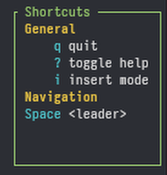
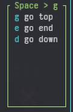

# ratatui-which-key

An application-level input handler and focus manager for [ratatui](https://github.com/ratatui/ratatui) applications with an API and popup widget inspired by [folke's which-key.nvim](https://github.com/folke/which-key.nvim).




`ratatui-which-key` is designed to handle all of the keyboard input for your application. You route input events to it from the main event loop, and it returns an `Action` to perform based on your configured keybinds.

Check out [the docs](https://docs.rs/crate/ratatui-which-key) for more info.

There is also a [sample application](examples/demo.rs) that you can run with `cargo run --example demo` which shows how to perform bindings and set up `ratatui-which-key` for usage in an app.

## How It Works

`ratatui-which-key` requires three data types be defined in your application.

### Scopes

The _scope_ is what part of your application is currently "in focus":

```rust
#[derive(Debug, Clone, Copy, PartialEq, Eq, PartialOrd, Ord)]
enum Scope {
    Normal,
    Insert,
    SearchPanel,
    // ....
}

// To change focus to another pane/window/section/area/etc:
app.which_key.set_scope(Scope::Insert)
```

### Actions

`ratatui-which-key` returns an `Action` when a keybind is triggered:

```rust
// Must implement Display to show the names in the which-key popup.
#[derive(derive_more::Display, Debug, Clone, Copy, PartialEq, Eq)]
enum Action {
    #[display("quit")]
    Quit,
    #[display("toggle help")]
    ToggleHelp,
    #[display("move up")]
    MoveUp,
    #[display("save")]
    Save,
    // ...
}
```

### Categories

The `ratatui-which-key` popup displays a header for each category available for a scope and then lists the associated keybinds under that category.

```rust
// Must implement Display to show the category names in the which-key popup.
#[derive(derive_more::Display, Debug, Clone, Copy, PartialEq, Eq)]
enum Category {
    General,
    Navigation,
    Search,
    // ...
}
```

## Keymap Configuration

You'll need to put a `WhichKeyState<CrosstermKey, Scope, Action, Category>` at the top-level of your application (like in `App`). Then at program start, configure your keybinds by creating a new `Keymap`. The code comments explain the different ways of performing keybindings.

```rust
struct App {
    // `Scope`, `Action`, and `Category` are all types defined in your application.
    which_key: WhichKeyState<CrosstermKey, Scope, Action, Category>,
}

let mut keymap = Keymap::new();
keymap
    // Keys can be bound individually by specifying both the category and scope.
    .bind("?", Action::ToggleHelp, Category::General, Scope::Global)
    // Sequences are supported. This binds to sequence "sg".
    .bind("sg", Action::SearchGrep, Category::General, Scope::Global)
    // "describe_group" adds a description to groups. Display will default to "..." if
    // no group description is found.
    .describe_group("<space>", "<leader>") // (key sequence, description)
    .describe_group("<leader>g", "general")
    // Bindings can be added to a specific group while also providing a description.
    .group("s", "search", |g| {
        // "sf" binding
        g.bind("f", Action::SearchFiles, Category::General, Scope::SearchPanel)
         // "sb" binding
         .bind("b", Action::SearchBuffers, Category::General, Scope::SearchPanel);
    })
    // However, using `.scope` is recommended in most cases since scopes represent whatever is
    // currently "in focus" for your app.
    .scope(Scope::Global, |global| {
        global
            .bind("?", Action::ToggleHelp, Category::General)
            .bind("j", Action::MoveDown, Category::Navigation)
            // control keys supported
            .bind("<c-c>", Action::Quit, Category::General)
            // f-keys supported
            .bind("<F1>", Action::ToggleHelp, Category::General)
            // sequences supported
            .bind("<leader>w", Action::Save, Category::General)
            // sequences can start with any key
            .bind("gof", Action::OpenFile, Category::General);
    })
    .scope(Scope::Insert, |insert| {
        // While in the `Insert` scope, all keys will be routed to this handler.
        insert.catch_all(|key| {
            // You can filter the keys here
            match key {
                CrosstermKey::Char(ch) => Some(Action::InsertModePrintableChar(ch)),
                CrosstermKey::Esc => Some(Action::ToNormalMode),
                _ => None
            }
        });
    })
    // Helper method if you want to bind based on category.
    .category(Category::Navigation, |nav| {
        nav
            .bind("k", Action::MoveUp, Scope::Global)
            .bind("j", Action::MoveDown, Scope::Global);
    })
    // Helper method if you want to bind based on both scope and category.
    .scope_and_category(Scope::Global, Category::Navigation, |g| {
       g.bind("<leader>gg", Action::MoveUp)
        .bind("<leader>gd", Action::MoveDown);
    });

// Create new state with a keymap and initial scope.
app.which_key = WhichKeyState::new(keymap, Scope::Global);
```

## Key Routing / Input Handling

To route keys to `ratatui-which-key`:

```rust
// In your input event loop:
if let Some(action) = app.which_key.handle_key(key).action {
    match action {
        Action::Quit => app.should_quit = true,
        Action::ToggleHelp => app.which_key.toggle(),
        Action::MoveUp => (), // whatever you want to happen
        Action::Save => (),
   }
}
```

## Rendering

To render:

```rust
// (in your top-level render function)
if app.which_key.active {
    let widget = WhichKey::new().border_style(Style::default().fg(Color::Green));
    widget.render(frame.buffer_mut(), &mut app.which_key);
}
```

## License

[AGPL-3.0-or-later](https://www.gnu.org/licenses/agpl-3.0.en.html)
